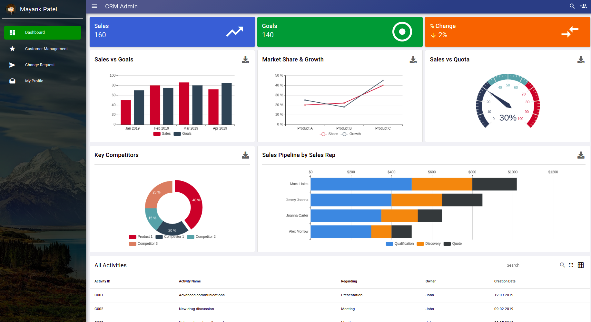
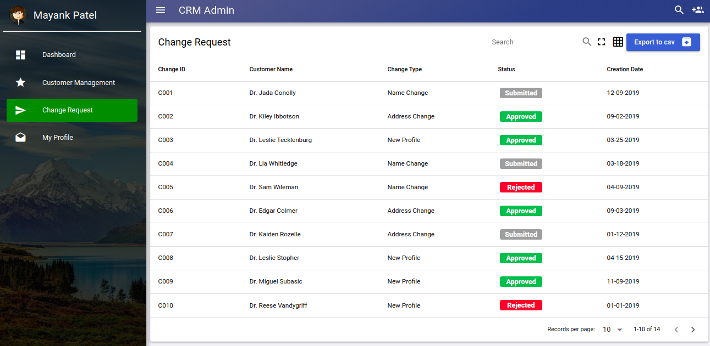
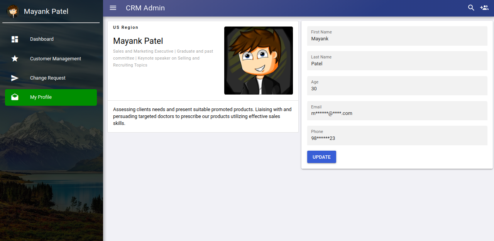

# Quasar Admin CRM Template

A free and beautiful Quasar template for CRM needs. This template also includes a variety of features that are required for admin template needs.

CRM Admin is a functional Quasar template designed for CRM, Customer Relationship Management. It is a fully responsive template built using the Quasar framework that makes it available for all screen sizes from big screens to smartphones.

Few Features:
* Modern and responsive design
* Building design based on CRM
* Simple CRM Dashboard
* Export feature

## Site: [https://quasar-admin-crm-template.netlify.com/](https://quasar-admin-crm-template.netlify.com/)

# Resources used
* [Quasar Framework](https://quasar.dev/)
* [Vue.js](https://vuejs.org/)


## Installation

* **Clone the repository**

```
git clone https://github.com/mayank091193/quasar-admin-crm.git
```

## Install the dependencies
```bash
cd quasar-admin-crm
npm install
```

### To run the app in development mode (hot-code reloading, error reporting, etc.)
```bash
quasar dev
```


### Build the application
```bash
quasar build
```

Do reach out to me at "mayank091193@gmail.com" for queries.

## Screens UI
**Dashboard**
<p float="left">
	<kbd>

		</kbd>
</p>

**Customer Management**
<p float="left">
	<kbd>
	
	</kbd>
</p>

**Change Request**
<p float="left">
	<kbd>

	</kbd>
</p>

**Profile**
<p float="left">
	<kbd>

	</kbd>
</p>

### Customize the configuration
See [Configuring quasar.conf.js](https://quasar.dev/quasar-cli/quasar-conf-js).

## License

[MIT](http://opensource.org/licenses/MIT)
